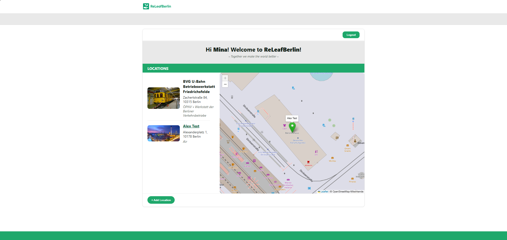
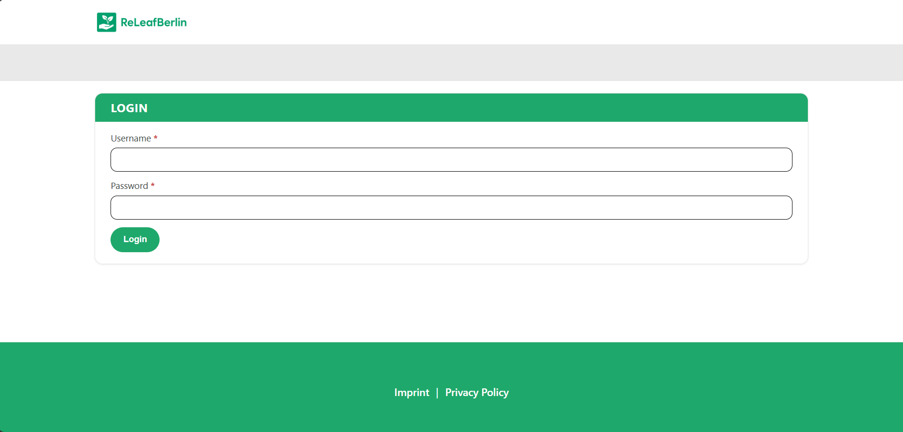
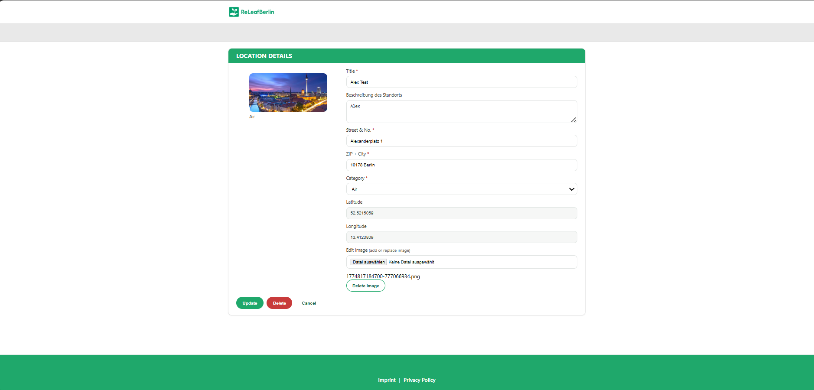

# 🌱 ReLeafBerlin

A full-stack web application for managing and visualizing sustainable and non-sustainable locations in Berlin.

This project was developed as part of the **Web Application Development (WAD)** course at HTW Berlin.

---

## -Overview

ReLeafBerlin is a Single Page Application (SPA) that allows users to explore, manage, and visualize environmental locations on an interactive map.

The application distinguishes between user roles and provides full CRUD functionality for location management.

---

## -Features

* Authentication with role-based access (Admin / User)
* Interactive map integration (Leaflet + OpenStreetMap)
* Location management (Create, Read, Update, Delete)
* Image upload and display for locations
* Dynamic list synchronized with map markers
* Marker highlighting & detail view
* Responsive and dynamic frontend (SPA)

---

## -Tech Stack

**Frontend**

* Vanilla JavaScript (SPA)
* HTML5 / CSS3

**Backend**

* Node.js
* Express.js (REST API)

**Database**

* MongoDB

**Map & Geocoding**

* OpenStreetMap
* Leaflet
* Nominatim (Geocoding)

---

## Architecture (Simplified)

Client (SPA)
⬇️
REST API (Express)
⬇️
MongoDB Database

* Frontend communicates via REST endpoints
* Backend handles logic, validation & geocoding
* Images are stored on the server (not in DB)

---

## 📸 Screenshots

```md




```

---

## -API (Overview)

Example endpoints:

* `GET /locations` → Get all locations
* `POST /locations` → Create new location
* `PUT /locations/:id` → Update location
* `DELETE /locations/:id` → Delete location

---

## -Author

**Ahmed Al-Odaini**
B.Sc. Applied Computer Science – HTW Berlin

---

## -Notes:

* This project was developed for educational purposes
* Focus: Full-stack development, REST APIs, and interactive UI
